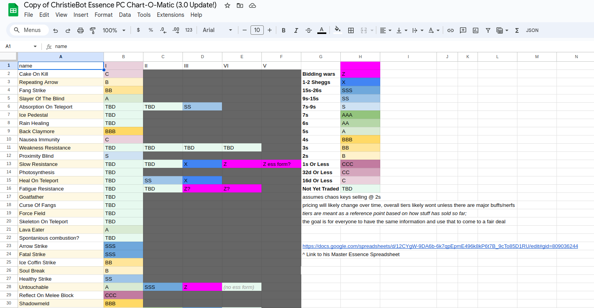
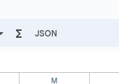

## How to create the json files
First we decide what the json structure should look like, for example:
```
	"": {
		"tier": {
			"I": null,
			"II": null,
			"III": null,
			"IV": null,
			"V": null
		}
	}
```

Next we edit the spreadsheet so that it is similar in terms of the structure.
<br>



<br>
After that, we use any sheets to json extension and highlight the cells we want, then download:



<br>
Last but not least, run the raw json and convert into the format that we defined in the `test` folder.